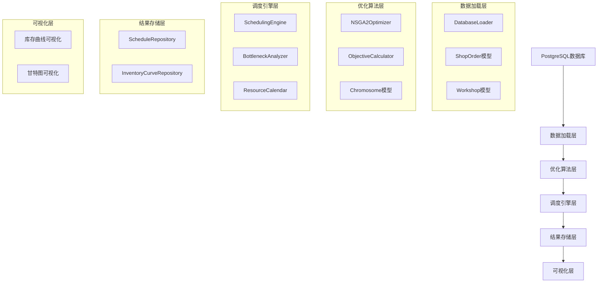

# 多车间多阶段生产排程优化系统 - 详细逻辑整理

## 系统概述

这是一个完整的多车间多阶段生产排程优化系统，集成了NSGA-II多目标优化算法、TOC瓶颈分析和PostgreSQL数据库支持。系统从MES/ERP系统读取生产数据，进行多目标优化排程，并将结果保存回数据库。

## 核心逻辑架构

## 详细逻辑流程

### 1. 数据加载与初始化

系统启动时，首先从PostgreSQL数据库加载所需数据：

1. **加载工单数据**：从`mom_shop_order`表读取待排程的工单信息
2. **加载工艺路线**：从`mom_router_step`等表读取每个工单的工艺路线信息
3. **加载资源信息**：从相关表读取车间、设备等资源信息
4. **加载班次信息**：从`mom_production_shift`表读取生产班次信息
5. **初始化资源日历**：根据班次信息构建资源可用时间模型

### 2. 瓶颈资源识别

使用TOC(Theory of Constraints)方法识别生产系统中的瓶颈资源：

1. **计算负载因子**：分析每个资源的计划负载与可用能力的比率
2. **计算利用率因子**：基于历史数据计算资源利用率
3. **计算换线因子**：考虑换线时间对资源可用性的影响
4. **综合评分**：使用加权公式计算每个资源的瓶颈指数
5. **确定瓶颈**：选择评分最高的资源作为系统瓶颈

### 3. NSGA-II多目标优化

系统使用NSGA-II算法进行多目标优化，优化目标包括：

1. **总工期(Makespan)**：最小化整个生产周期
2. **总延迟(Total Lateness)**：最小化工单交付延迟
3. **库存波动(Inventory Fluctuation)**：最小化库存水平波动

#### NSGA-II算法流程：

1. **初始化种群**：随机生成初始工单排序方案
2. **评估适应度**：对每个染色体(工单序列)计算三个目标函数值
3. **非支配排序**：将种群划分为多个Pareto前沿
4. **拥挤距离计算**：计算同一前沿中个体的拥挤距离
5. **选择操作**：基于排名和拥挤距离进行锦标赛选择
6. **交叉操作**：使用顺序交叉(OX)生成新个体
7. **变异操作**：使用交换变异引入多样性
8. **新一代生成**：合并父代和子代，选择最优个体
9. **迭代优化**：重复上述过程直到达到最大迭代次数

### 4. 调度引擎逻辑

调度引擎根据工单类型(推式/拉式)采用不同的排程策略：

#### 推式排程(正向排程)：

1. **瓶颈资源优先**：首先为瓶颈资源安排生产任务
2. **非瓶颈资源排程**：然后为非瓶颈资源安排任务
3. **安全库存考虑**：为需要安全库存的工序添加缓冲时间
4. **时间计算**：考虑学习曲线效应调整工序时间

#### 拉式排程(反向排程)：

1. **从交付日期开始**：以工单的计划完成时间为起点
2. **逆向排程**：逆向计算每个工序的开始和结束时间
3. **瓶颈保护**：为瓶颈工序添加保护时间
4. **工序间隔**：考虑工序之间的间隔时间

### 5. 目标函数计算

对于每个染色体(工单序列)，计算三个目标函数值：

1. **总工期计算**：
   - 按序列顺序排程每个工单
   - 记录每个工单的完成时间
   - 取所有工单完成时间的最大值作为总工期

2. **总延迟计算**：
   - 比较每个工单的实际完成时间和计划完成时间
   - 累加所有工单的延迟时间

3. **库存波动计算**：
   - 模拟生产过程中的库存变化
   - 工单完成时库存增加
   - 交付客户时库存减少
   - 计算库存水平的方差作为波动指标

### 6. 结果存储与可视化

优化完成后，系统将结果保存到数据库：

1. **排程结果保存**：将每个工单的工序排程保存到`mom_shop_order_schedule`表
2. **库存曲线保存**：将每个Pareto解的库存变化曲线保存到`mom_schedule_inventory_curve`表
3. **可视化支持**：提供库存曲线和甘特图可视化功能

## Chromosome类详细逻辑

Chromosome类是NSGA-II算法的核心，代表一个可能的解(工单排序方案)：

1. **基因表示**：使用工单序列作为基因编码
2. **目标值存储**：存储三个目标函数的值(总工期、总延迟、库存波动)
3. **非支配排序**：存储个体在Pareto前沿中的排名
4. **拥挤距离**：存储个体在同一前沿中的拥挤距离，用于保持种群多样性
5. **复制功能**：提供copy()方法用于创建染色体副本

## 系统特点与优势

1. **多目标优化**：同时优化工期、延迟和库存波动三个目标
2. **TOC集成**：基于约束理论的瓶颈资源识别与优化
3. **多车间支持**：支持多车间、多阶段的生产排程
4. **安全库存约束**：考虑安全库存要求的生产排程
5. **可视化支持**：提供库存曲线和甘特图可视化
6. **数据库集成**：直接与PostgreSQL数据库交互
7. **可扩展架构**：模块化设计，易于扩展和维护

## 应用场景

该系统适用于以下生产环境：

1. **多车间生产**：产品需要经过多个车间/工序完成
2. **复杂工艺路线**：产品有复杂的生产工艺流程
3. **库存敏感**：需要严格控制库存水平的生产环境
4. **交期严格**：对订单交付时间有严格要求的生产环境
5. **资源受限**：存在明显瓶颈资源的生产环境

