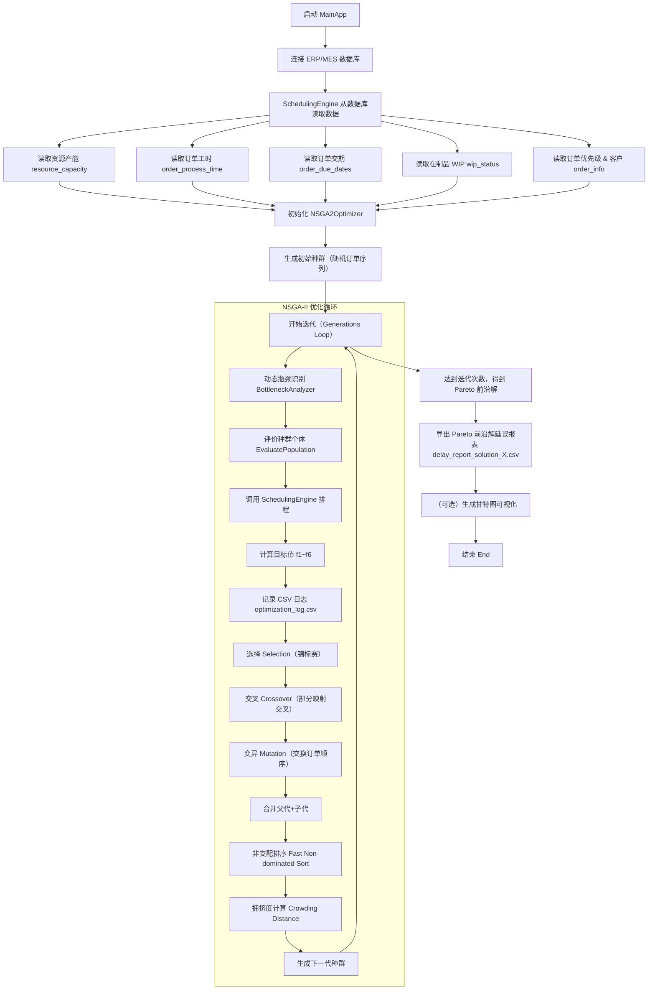

```mermaid
flowchart TD  
A[启动 MainApp] --> B[连接 ERP/MES 数据库]  
B --> C[SchedulingEngine 从数据库读取数据]  
C --> C1[读取资源产能 resource_capacity]  
C --> C2[读取订单工时 order_process_time]  
C --> C3[读取订单交期 order_due_dates]  
C --> C4[读取在制品 WIP wip_status]  
C --> C5[读取订单优先级 & 客户 order_info]  
C1 --> D  
C2 --> D  
C3 --> D  
C4 --> D  
C5 --> D

    D[初始化 NSGA2Optimizer] --> E[生成初始种群（随机订单序列）]  
    E --> F[开始迭代（Generations Loop）]  
  
    subgraph NSGA-II 优化循环  
        F --> G[动态瓶颈识别 BottleneckAnalyzer]  
        G --> H[评价种群个体 EvaluatePopulation]  
        H --> H1[调用 SchedulingEngine 排程]  
        H1 --> H2[计算目标值 f1~f6]  
        H2 --> I[记录 CSV 日志 optimization_log.csv]  
        I --> J[选择 Selection（锦标赛）]  
        J --> K[交叉 Crossover（部分映射交叉）]  
        K --> L[变异 Mutation（交换订单顺序）]  
        L --> M[合并父代+子代]  
        M --> N[非支配排序 Fast Non-dominated Sort]  
        N --> O[拥挤度计算 Crowding Distance]  
        O --> P[生成下一代种群]  
        P --> F  
    end  
  
    F --> Q[达到迭代次数，得到 Pareto 前沿解]  
    Q --> R[导出 Pareto 前沿解延误报表 delay_report_solution_X.csv]  
    R --> S[（可选）生成甘特图可视化]  
    S --> T[结束 End] 
```